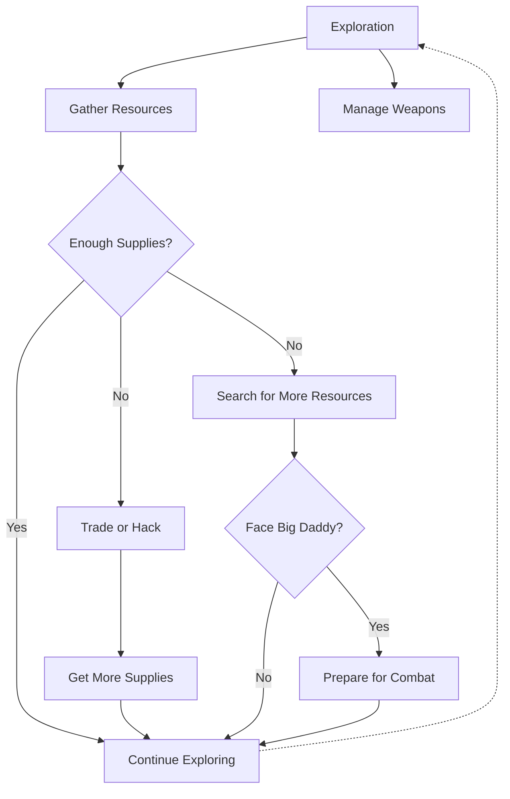

# Bioshock
**Developer** ~~**and publisher**~~ : Irrational Games   
**Publisher**: 2K Games  
**Release Year**: 2007

## Introduction
**Bioshock** is a first-person shooter video game set in the underwater city of Rapture. Players explore the dystopian world while combating enemies and uncovering the mysterious story behind the city's downfall. The game emphasizes exploration, resource management, and moral choices that affect the outcome.

> *We all make choices, but in the end, our choices make us.*
> 
> Andrew Ryan

---

## Gameplay Overview

### Key Features

* **Exploration**: Discover the secrets of Rapture while gathering supplies.
* **Combat**: Use a combination of weapons, plasmids, and the environment to defeat enemies.
* **Resource Management**: Scavenge for ammo, health, and ADAM to survive.
* **Moral Choices**: Decide the fate of Little Sisters, influencing the game's ending.

--- 

## Gameplay Loop

---
## External Resources
For more detailed guides and strategies, visit the following:
* [Official Website](https://www.2kgames.com/bioshock/)

