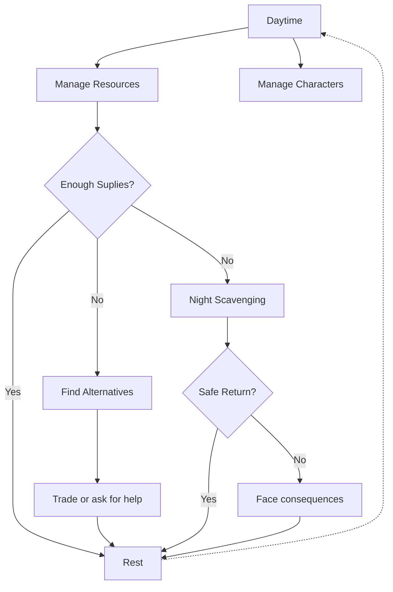

# This War of Mine

**Developer** *and publisher* : 11 bit studios   
~~**Publisher**: 11 bit studios~~   
**Release Year**: 2014

## Introduction

*This War of Mine* is a war survival video game where players control a group of civilians trying to survive in a besieged city. The game focuses on managing resources, making moral decisions, and ensuring the survival of the group amidst war-time challenges.

> *In modern war... you die like a dog for no good reason*
> 
> Ernest Hemingway

---

## Gameplay Overview

### Key Features
* **Survival**: Manage hunger, health, and morale of your group.
* **Crafting**: Build tools, medicine, and defenses.
* **Scavenging**: Go out at night to search for food and materials.
* **Shelter Management**: Improve and maintain your shelter to protect the group.

--- 

## Gameplay Loop

---

## External Resources

For more detailed guides and strategies, visit the following:
* [Official Website](https://www.11bitstudios.com/this-war-of-mine)

